# How-to-Install-Gitlab-Server
How to Install Gitlab Server with Docker on Ubuntu

# Step 1 - Installing Dependencies
Before we install Gitlab, we need to make sure our server has certain software that Gitlab will need to run properly. Run the following commands to install the dependencies.

```sh
 $ sudo apt update
 $ sudo apt install ca-certificates curl openssh-server ufw apt-transport-https -y
```

Some of the software above may be pre-installed for you.

# Step 2 - Change your System's SSH Port
Gitlab will use port 22 for pushing repositories via SSH. Your server's SSH is also running on it which will generate conflict. There are two ways to go about it. Either you can change the SSH port you use to connect to your system or you can change the port Gitlab will use for SSH. In this tutorial, we are going to change the SSH port for the server itself.
To do this, we need to edit the /etc/ssh/sshd_config file. Open the file in the nano text editor.

```sh
 $ sudo nano /etc/ssh/sshd_config
```

Find the following line and change 22 to 6622 and remove the # in front of it. You can choose any port you want.

```sh
 # Port 22
```
Press Ctrl + X to close your file and press Y to save the changes.

Restart the SSH service.

```sh
 $ sudo systemctl restart sshd
```

Close your current SSH session and create a new one with the port 6622 and connect to your server again.

```sh
 $ ssh non-root-sudo-user@192.0.2.2 -p 6622
```

# Step 3 - Configuring Firewall
In our previous step, we installed, ufw (Uncomplicated Firewall). Before we can proceed to install Gitlab, we need to configure it.

Enable SSH and the port we just created so that we don't get locked out.

```sh
$ sudo ufw allow OpenSSH
$ sudo ufw allow 6622
```

Enable the ufw firewall.
```sh
$ sudo ufw enable
```
We also need to enable http and https for Gitlab to operate.

```sh
$ sudo ufw allow http
$ sudo ufw allow https
```

Check the status of the firewall.

```sh
 $ sudo ufw status
```
You should see an output like the following.

```sh
Status: active

To                         Action      From
--                         ------      ----
OpenSSH                    ALLOW       Anywhere                  
6622                       ALLOW       Anywhere                  
80/tcp                     ALLOW       Anywhere                  
443/tcp                    ALLOW       Anywhere                  
OpenSSH (v6)               ALLOW       Anywhere (v6)             
6622 (v6)                  ALLOW       Anywhere (v6)      
80/tcp (v6)                ALLOW       Anywhere (v6)             
443/tcp (v6)               ALLOW       Anywhere (v6)  
```

# Step 4 - Install Docker
Add Docker's GPG key to your system.

```sh
$ curl -fsSL https://download.docker.com/linux/ubuntu/gpg | sudo apt-key add -
```
Verify the fingerprint of the downloaded key.

```sh
$ sudo apt-key fingerprint 0EBFCD88
```
You should see an output like the following.

```sh
pub   rsa4096 2017-02-22 [SCEA]
      9DC8 5822 9FC7 DD38 854A  E2D8 8D81 803C 0EBF CD88
uid           [ unknown] Docker Release (CE deb) <docker@docker.com>
sub   rsa4096 2017-02-22 [S]
```
Add the Docker repository.

```sh
$ sudo add-apt-repository "deb [arch=amd64] https://download.docker.com/linux/ubuntu $(lsb_release -cs) stable"
```
Update your package database.

```sh
$ sudo apt update
```
Install Docker-CE. CE is the Community Edition of the Docker.

```sh
$ sudo apt install docker-ce -y
```
Docker should be installed now. Check that it's running.
```sh
$ sudo systemctl status docker
```
The output should be similar to the following.

```sh
? docker.service - Docker Application Container Engine
   Loaded: loaded (/lib/systemd/system/docker.service; enabled; vendor preset: enabled)
   Active: active (running) since Thu 2019-10-11 21:10:31 UTC; 32s ago
     Docs: https://docs.docker.com
 Main PID: 19128 (dockerd)
    Tasks: 12
   CGroup: /system.slice/docker.service
           ??19128 /usr/bin/dockerd -H fd:// --containerd=/run/containerd/containerd.sock
```
Press q to exit.

Add your limited Linux user account to the docker group so that you can run docker without sudo.

```sh
sudo usermod -aG docker $USER
```
$USER variable will pick and add the current logged in user to the docker group. Replace $USER with the actual username if you are not currently logged in with that user.

Switch to the user we just added. Even though you were already logged in, you will still need to switch to it again to reload the permissions.

```sh
$ su - ${USER}
```
Check that everything is running fine by running the built-in "Hello World" program.

```sh
$ docker run hello-world
```
You should see the following output which will tell Docker is installed and working properly.

```sh
Unable to find image 'hello-world:latest' locally
latest: Pulling from library/hello-world
1b930d010525: Pull complete 
Digest: sha256:c3b4ada4687bbaa170745b3e4dd8ac3f194ca95b2d0518b417fb47e5879d9b5f
Status: Downloaded newer image for hello-world:latest

Hello from Docker!
This message shows that your installation appears to be working correctly.
```
# Step 5 - Install Docker Compose
It's possible to skip this step and proceed but having Docker Compose installed will make running Gitlab much easier especially if you want to do it on more than one server.

```sh
$ sudo curl -L "https://github.com/docker/compose/releases/download/1.24.1/docker-compose-$(uname -s)-$(uname -m)" -o /usr/local/bin/docker-compose
```
At the time of writing this tutorial, 1.24.1 is the current stable release of Docker Compose. You can check for the latest release version from their Github page.

Apply executable permissions to the docker compose binary.

```sh
$ sudo chmod +x /usr/local/bin/docker-compose
```
Add Command Completion to Docker Compose.

```sh
$ sudo curl -L https://raw.githubusercontent.com/docker/compose/1.24.1/contrib/completion/bash/docker-compose -o /etc/bash_completion.d/docker-compose
```
Verify if your installation was successful.

```sh
$ docker-compose --version
```
It will print out the following output.

```sh
docker-compose version 1.24.1, build 4667896b
```
# Step 6 - Install Gitlab

Download Gitlab's Docker image from Dockerhub. This image contains everything you need to run Docker - nginx, PostgreSQL, Redis, etc. Run the following command to download the image.

```sh
$ docker pull gitlab/gitlab-ee:latest
```
Even though this tutorial is about installing the Community Edition, yet we will grab the Enterprise Edition image of Gitlab. This is because Enterprise edition behaves exactly like the Community Edition unless you upgrade to it by entering your license. Upgrading a Community Edition installation to the Enterprise Edition presents more complications.

It will take a little while to download the complete the image. When the job is finished, you can run the following command to check all the images currently on your system.

```sh
$ docker images
```
The output should look similar to the following.

```sh
REPOSITORY          TAG                 IMAGE ID            CREATED             SIZE
gitlab/gitlab-ee    latest              4bacb2356d28        4 days ago          1.87GB
hello-world         latest              fce289e99eb9        9 months ago        1.84kB
```
# Step 7 - Run Gitlab
We can run Gitlab container straight away at this point by supplying all the options in a single command but that would mean every time you need to run the container, you need to supply these variables. Docker Compose makes this process easier as it will allow you to save the configuration into a .yml file which will be then used to run and launch the container.

Create a docker-compose.yml.

```sh
$ nano docker-compose.yml
```
Paste the following code.

```sh
web:
  image: 'gitlab/gitlab-ee:latest'
  container_name: 'gitlab-howtoforge-tutorial'
  restart: always
  hostname: 'gitlab.example.com'
  environment:
    GITLAB_OMNIBUS_CONFIG: |
      external_url 'https://gitlab.example.com'
      gitlab_rails['smtp_enable'] = true
      gitlab_rails['smtp_address'] = "smtp.gmail.com"
      gitlab_rails['smtp_port'] = 587
      gitlab_rails['smtp_user_name'] = "user@gmail.com"
      gitlab_rails['smtp_password'] = "app-password"
      gitlab_rails['smtp_domain'] = "smtp.gmail.com"
      gitlab_rails['smtp_authentication'] = "login"
      gitlab_rails['smtp_enable_starttls_auto'] = true
      gitlab_rails['smtp_tls'] = false
      gitlab_rails['smtp_openssl_verify_mode'] = 'peer'
      # Add any other gitlab.rb configuration here, each on its own line
  ports:
    - '80:80'
    - '443:443'
    - '6622:6622'
    - '587:587'
  volumes:
    - '/srv/gitlab/config:/etc/gitlab'
    - '/srv/gitlab/logs:/var/log/gitlab'
    - '/srv/gitlab/data:/var/opt/gitlab'
```

Let's see what each of the options above means.

1. image refers to the location of the Docker image of Gitlab on Dockerhub.
2. container_name allows you to apply a label to your docker container, for use when referencing the container within a Docker network.
3. hostname defines the container's internal hostname or in our case, the URL at where your Gitlab will be installed.
4. restart specifies a restart policy for the container. We have set it to always which means a container if exited, will automatically get restarted.
5. environment supplies the variable GITLAB_OMNIBUS_CONFIG which allows you to enter any Gitlab configuration setting. In this case, we supplied the external URL that Gitlab is supposed to use.
6. volume defines the directories mounted on in the server to store persistent data. The three volumes/directories store application data, log files and configuration files. The value to the left of the semi-colon is the local directory on the server, and the value to the right is the directory inside the container.
7. publish tells the container to publish ports or a range of ports to the host. Since Gitlab needs ports 22(SSH), 80(HTTP), 443(HTTPS) and 587(SMPT - MSA), we have specified them here. If you want Gitlab to use a non-standard port on your server (probably because it's not available), you would provide the host port first and then the container port. For eg, since your server is already using SSH(22) port, you can tell Gitlab to use SSH via a different port, say 3333. Then you would change 22:22 in the above file to 3333:22. You will also need to add the line gitlab_rails['gitlab_shell_ssh_port'] = 3333 under GITLAB_OMNIBUS_CONFIG above.
8. external_url refers to the domain where your Gitlab will be installed. We have chosen https which will automatically install Let's Encrypt SSL certificate for us.
9. We have also added additional configuration to configure Gitlab to use Gmail for sending mails. You can use any 3rd party SMTP mail service. Gitlab docs have maintained a detailed guide on how to configure various SMTP services with it.

Make sure you are in the same directory as docker-compose.yml. Run the following command to start Gitlab.

```sh
$ docker-compose up -d
```
You will see something like the following.

```sh
Creating gitlab-howtoforge-tutorial ... done
```
It will take several more minutes before you can access Gitlab via the browser. You can find out more about the startup process via the following command.

```sh
$ docker logs -f gitlab-howtoforge-tutorial
```
To exit the log monitoring process, press Ctrl + C.

Load the Gitlab site in your browser. If you try to load it too shortly after starting the container, you will get the 502 error. If that happens, wait for a few more minutes and try again.

If everything is fine, then you will see the following page in your browser.

 <p align="center">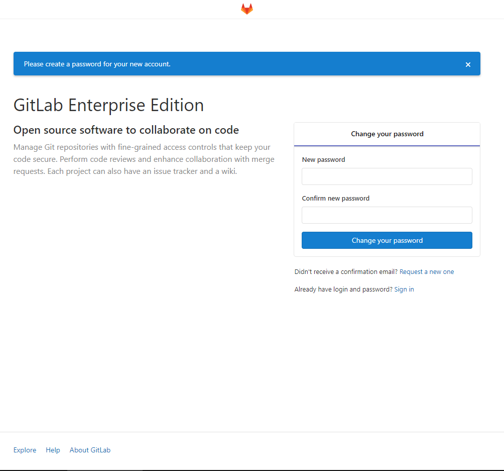</p>
 
# Step 8 - Configure Gitlab
Provide a password for Gitlab's Administrator Password. You will be taken to the login screen next. Use root as the username and password you just chose to log in.

 <p align="center">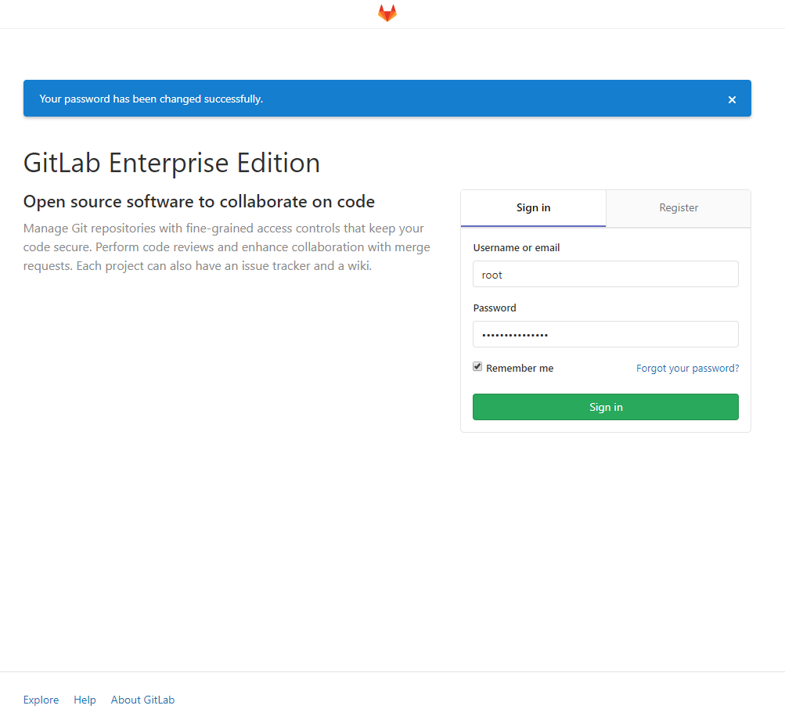</p>
 
```sh
docker exec -it gitlab-howtoforge-tutorial grep 'Password:' /etc/gitlab/initial_root_password

Password cqksv/ZB4bH0T6GM+rHBR+f8E3WexzkOX9dS8nagUw0=
```

# Configure SMTP
We will need to enable SMTP settings before we

# Configure Gitlab Profile
Click on the user icon on the upper right-hand corner to bring up the drop-down menu and select settings.

 <p align="center">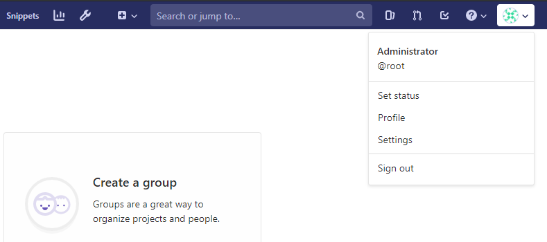</p>
 
You will be taken to your Profile settings page. Add your name and e-mail here. You will need to confirm your email address for it to be updated. You can also add more information here about yourself if you want.

 <p align="center">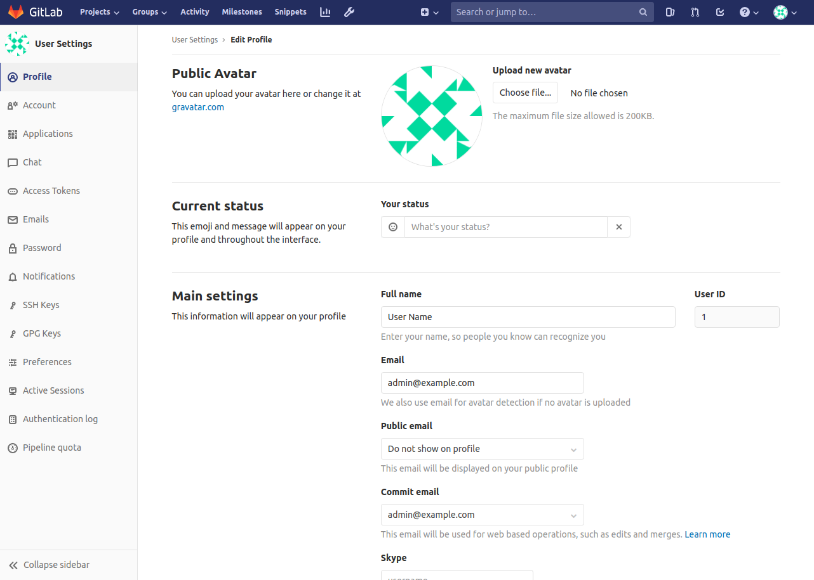</p>
 
Click Update Profile Settings when you are done.

# Change User Name
Next, we need to change our username from root to something else as root is a pretty common guessable username. Click on Account in the left sidebar.

 <p align="center">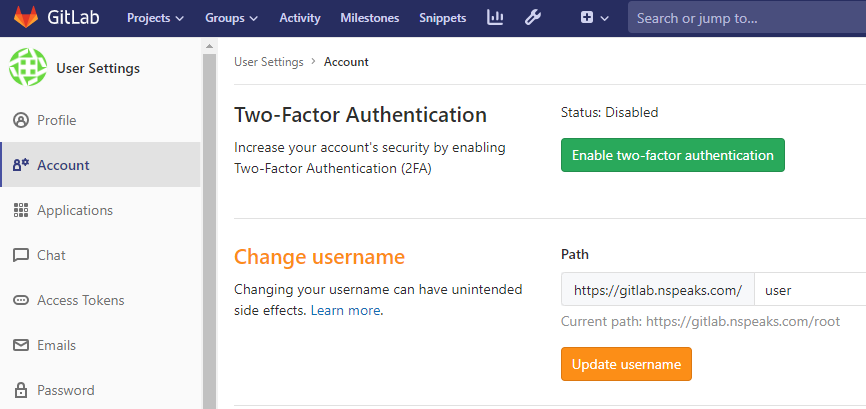</p>
 
Change the user to whatever username you want to keep. Click on Update username to finish. You should also enable two-factor authentication here for more security.

# Restrict Public Sign-ups
By default, Gitlab installations allow anyone to sign up. If you don't want that, you should disable it. Click on the wrench looking icon in the top bar to access the Administration area.

 <p align="center">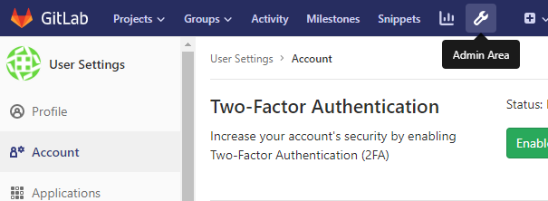</p>
 
To adjust settings, click on Settings in the left sidebar.

 <p align="center">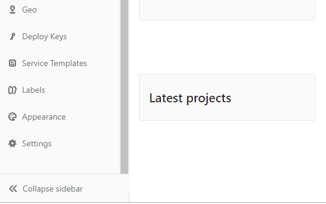</p>
 
Here, scroll down to the Sign-up restrictions and click on the Expand button. Uncheck the Sign-up enabled box and click on Save changes when finished.

 <p align="center">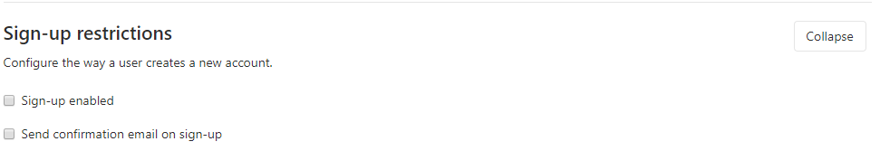</p>
 
You will still be able to add new users via the Admin interface.

# Add SSH Key
The last step is adding our SSH key. If you have an SSH key, you can skip the following command. If you don't have one, you can create one using the following command.

```sh
$ ssh-keygen
```

This command is common to Mac OS, Linux and Git Bash/WSL on Windows. Accept the defaults and leave the passphrase field blank.

```sh
Generating public/private rsa key pair.
Enter file in which to save the key (/home/test/.ssh/id_rsa): /home/test/.ssh/gitlab
Enter passphrase (empty for no passphrase): 
Enter same passphrase again: 
Your identification has been saved in gitlab.
Your public key has been saved in gitlab.pub.
The key fingerprint is:
SHA256:6dNGAPyd8JAkHAikYOW2PsFjGlzBBpwy4XQ9RQgVwK8 user@userpc
The key's randomart image is:
+---[RSA 2048]----+
|+*OB=*O=..       |
|B+o+o+oo+        |
|oo.+. ...= .     |
|. + ..  .o+      |
| o *.   S .      |
|  =Eo  . o       |
| . o    o o      |
|    .    o       |
|                 |
+----[SHA256]-----+
```

You can display your public key via the following command

```sh
$ cat ~/.ssh/gitlab.pub
```
```sh
ssh-rsa AAAAB3NzaC1yc2EAAAADAQABAAABAQDUf64YH7uJimFWVJSy/mgYiLRqBxVB6JJMTxZZ96DwExoINhWVRhQAgMgExBWGpUCpWXhLcNuIM+EfFRtCq+YYyLC+GlHsNdnLgecGgop72p8BEi8UckgCiCSuMrWCMAOFh5NKs2YHpF7bOUjXQRVvGujLuV1UBof7SXQ/za7e3aybNiH3KpA6oWSSmpqnOt8rZT54IjLnVFUSLx7ZxWDVW1bO29mI8NjWwzZGLAtNIkJQEOqVo8nhVkroFHvBTrZnUsmr5oFOWG++LPqED9EUSPTpO8PNnogYT3xsVncBMMAEt0pPE7ATmstQc161SEtqAUa98Qb0RRKqCKcKStOp user@userpc
```
Go back to your Profile's Settings area and access SSH keys from the sidebar.

 <p align="center">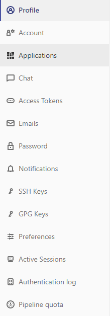</p>
 
Paste the SSH key in the box provided and click on Add Key to proceed.

 <p align="center">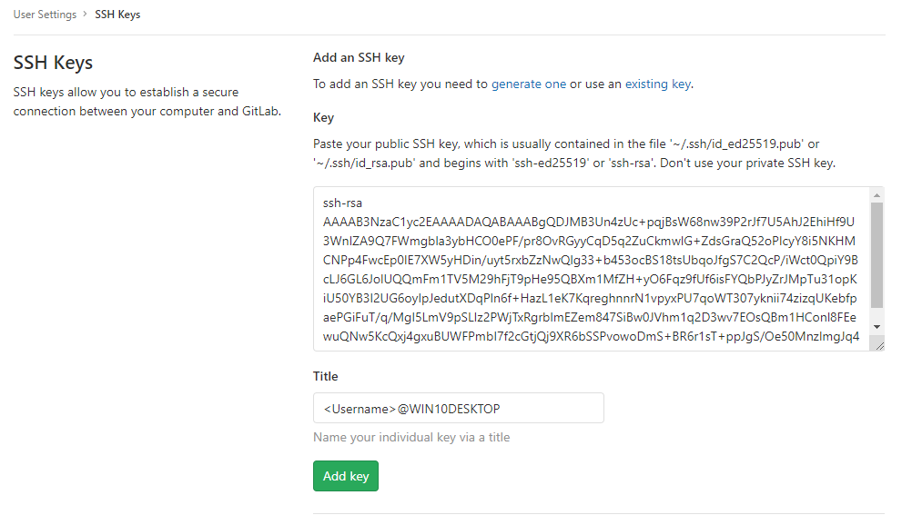</p>
 
Now you can create and commit to your repositories without having to provide your Gitlab credentials.

# Step 9 - Create your First Project
Each repository in Gitlab belongs to a project. A project includes a repository, issue tracker, merge requests, wiki, continuous integration and continuous delivery (CI/CD) pipelines, and lots of other features.

To create your first repository, click Create a project.

 <p align="center"></p>
 
You will be taken to the New Project page. Enter the project name. You can change the project slug to something different. Enter a description of the project if you like and change the visibility of the project as you desire. You can Initialize your repository with a README file. Once you are done, click Create project.

 <p align="center">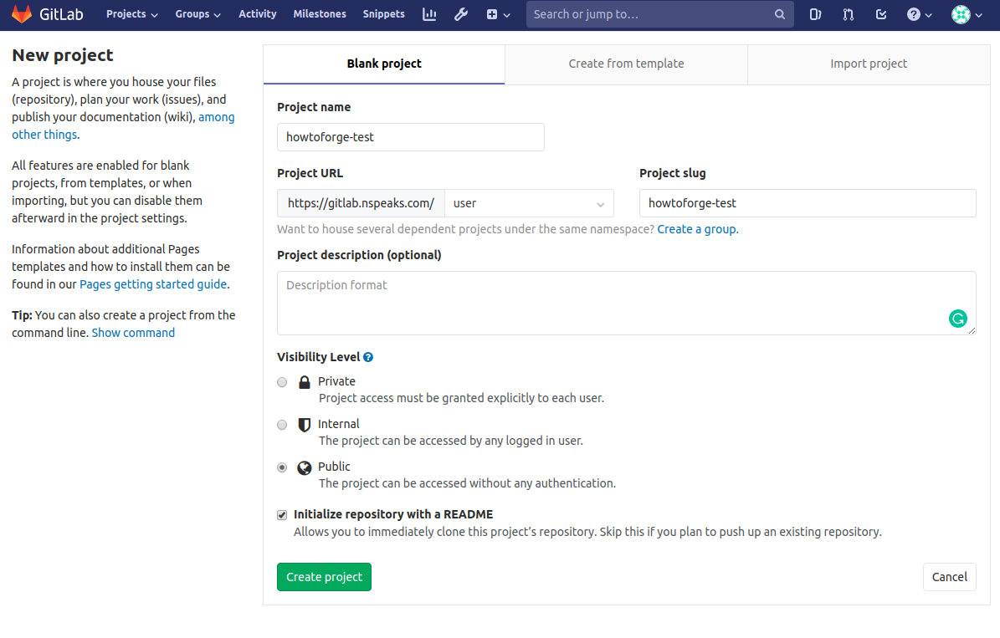</p>
 
You will be taken to your repository page with just a single blank README.md file.

 <p align="center">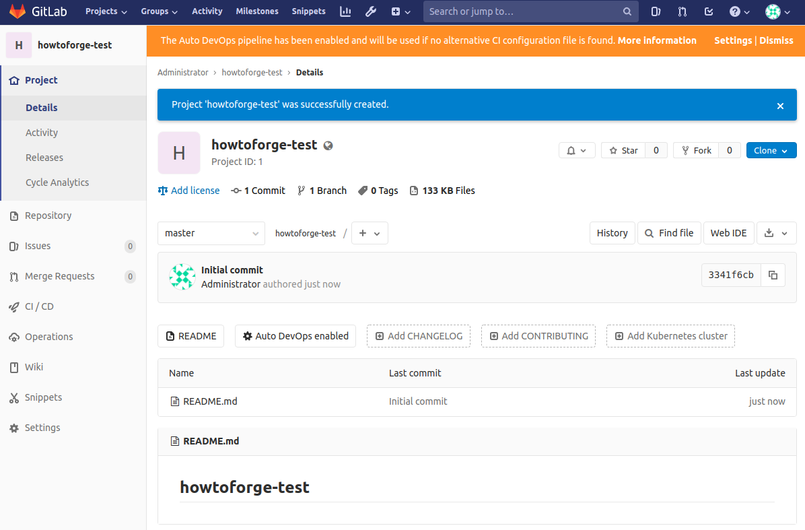</p>
 
Now that our repository is live, let us try adding a changelog from the command line.

Enter the following commands on your computer to create a CHANGELOG file and push it back to your repository. Make sure you have Git installed on your computer.

Clone the repository. You can clone either using SSH or HTTPS.

Clone using SSH.

```sh
$ git clone git@gitlab.example.com:user/howtoforge-test.git
```
or Clone using HTTPS.

```sh
$ git clone https://gitlab.example.com/user/howtoforge-test.git
```

# Step 10 - Manage Gitlab Container
To view all the running containers, run the following command.
```sh
$ docker ps
```
To stop your Gitlab container, run the following command.

```sh
$ docker stop gitlab-howtoforge-tutorial
```
To start your container again, use the following command.

```sh
$ docker start gitlab-howtoforge-tutorial
```

# Step 11 - Upgrade Gitlab
If you want to upgrade Gitlab to the newest version, you need to stop and remove the existing container, pull the latest image and then recreate the container.

```sh
$ docker stop gitlab-howtoforge-tutorial
$ docker rm gitlab-howtoforge-tutorial
$ docker pull gitlab/gitlab-ee:latest
$ docker-compose up -d
```
And before you ask, your data will be safe even if you remove the container.

This concludes our tutorial about setting up Gitlab on Ubuntu 18.04 server using Docker. If you have any questions, post them in the comments below.
